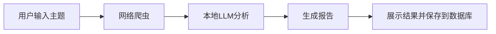

# BettaFish 简化版舆情分析系统

<p align="center">
  
</p>

<p align="center">
  <strong>一个完全本地化运行的舆情分析系统</strong>
</p>

<p align="center">
  <a href="#功能特性">功能特性</a> •
  <a href="#系统要求">系统要求</a> •
  <a href="#安装指南">安装指南</a> •
  <a href="#使用方法">使用方法</a> •
  <a href="#项目结构">项目结构</a>
</p>

---

## 功能特性

BettaFish 简化版是一个专为本地运行设计的舆情分析系统，集成了网络爬虫、本地大语言模型分析和报告生成功能，能够在没有互联网连接的情况下运行。

### 核心功能

- 🕵️‍♂️ **网络爬虫** - 模拟从网络上抓取与特定主题相关的内容
- 🧠 **本地LLM分析** - 使用本地部署的 Qwen 大语言模型进行舆情分析，保证数据隐私
- 📊 **智能分析** - 对收集的数据进行情感分析、主题提取和趋势预测
- 📄 **报告生成** - 自动生成结构化的舆情分析报告
- 🌐 **Web界面** - 提供友好的 Web 界面，方便用户操作
- 📚 **历史记录** - 自动保存分析历史，支持回溯查看


## 系统要求

### 最低配置

- Python 3.8+
- 至少 8GB 内存
- 10GB 磁盘空间（用于存放模型文件）

### 推荐配置

- Python 3.8+
- 16GB+ 内存
- NVIDIA GPU (CUDA 支持) 以显著提升处理速度
- 20GB+ 磁盘空间

## 安装指南

### 1. 克隆项目

```bash
git clone <repository-url>
cd bettafish_local3
```

### 2. 安装依赖

```bash
pip install -r requirements.txt
```

### 3. 配置本地模型

确保本地 Qwen 模型位于指定路径：

```
D:\project\Xianyu_AutoAgent\model\qwen\Qwen2___5-1___5B-Instruct
```

如果模型存放在其他位置，请修改 [config.py](config.py) 中的 `LOCAL_LLM_PATH` 变量。

### 4. 验证安装

```bash
python app.py "测试主题"
```

## 使用方法

### 命令行模式

```bash
python app.py "分析主题"
```

或者进入交互式模式：

```bash
python app.py
```

### Web 界面模式

```bash
python web_app.py
```

然后在浏览器中访问 http://localhost:5000

## 项目结构

```
bettafish_local3/
├── app.py                 # 命令行主应用
├── web_app.py             # Web应用
├── config.py              # 配置文件
├── simple_crawler.py      # 简化版爬虫
├── local_llm.py           # 本地LLM客户端
├── analyzer.py            # 分析器
├── reporter.py            # 报告生成器
├── db.py                  # 数据库模块
├── requirements.txt       # 依赖包列表
├── README.md              # 说明文档
├── templates/             # Web模板文件
│   ├── base.html          # 基础模板
│   └── index.html         # 主页模板
└── static/                # 静态资源文件
    └── style.css          # 样式文件
```

## 工作流程



1. 用户输入分析主题
2. 系统启动网络爬虫抓取相关内容
3. 使用本地 Qwen 大语言模型分析舆情
4. 生成结构化的分析报告
5. 展示结果并保存到本地 SQLite 数据库

## 技术栈

- **后端**: Python 3.8+, Flask 2.0.3
- **AI框架**: PyTorch 2.0.1, Transformers 4.35.0
- **数据库**: SQLite
- **前端**: HTML, CSS, JavaScript
- **日志**: Loguru 0.6.0
- **爬虫**: Requests 2.31.0, BeautifulSoup 4.12.2

## 注意事项

1. 首次运行时会加载大型语言模型，可能需要较长时间（取决于硬件配置）
2. 确保有足够的磁盘空间存放模型文件
3. 推荐使用 NVIDIA GPU 以获得更好的性能体验
# 效果展示


